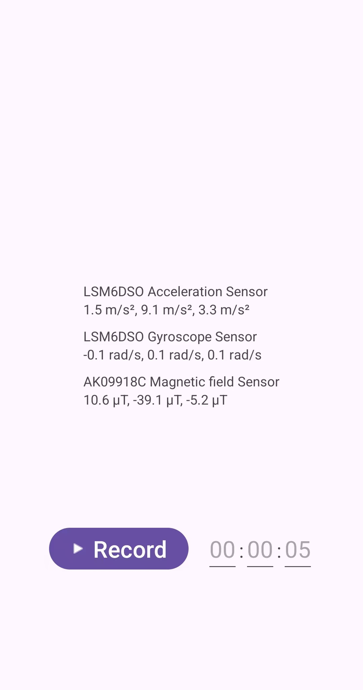

# IMU Collector

A lightweight Android application for collecting and logging Inertial Measurement Unit (IMU) sensor data with real-time visualization.

## Features

- Collects data from three IMU sensors:
  - Accelerometer (acc)
  - Gyroscope (gyr)
  - Magnetometer (mag)
- Real-time sensor data visualization
- Automated data recording with customizable duration

## Data Storage

Files are saved in the app's external cache directory with the following format:
```
YY-MM-DD HH:mm:ss.SSS acc.txt
YY-MM-DD HH:mm:ss.SSS gyr.txt
YY-MM-DD HH:mm:ss.SSS mag.txt
```

### File Format

Each sensor data file contains coma-separated values:
```
Timestamp,X,Y,Z
```

Units:
- Accelerometer: m/s²
- Gyroscope: rad/s
- Magnetometer: μT

## Building

1. Clone the repository
2. Open in Android Studio
3. Build and run


